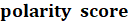
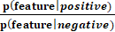
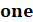
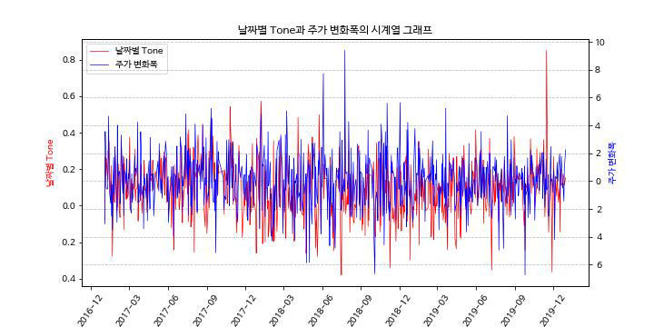

# DB 금융경제 공모전
## NBC 를 활용한 뉴스 감성 분석 및 LSTM 을 이용한 주가 등락 예측 : LDA 토픽 모델링 기반의 텍스트 필터링을 통해


## 분석 절차

- 데이터 수집 (Scrapy, BeautifulSoup)
- 데이터 전처리
- LDA 토픽 모델링
- n-grammize 후 NBC로 감성사전 구축
- 주가와 날짜별 감성 지수 상관관계 분석
- LSTM으로 주가 등락 예측


## 데이터 수집

- 뉴스 데이터

  - LG화학 관련 뉴스 (2017~2019)
  - Scrapy, BeautifulSoup 라이브러리
  - 30,791개

- 주가 데이터

  - 한국거래소 일별 시세 (2017~2019)

  

## 데이터 전처리

- 언론사별 정규표현식 통해 헤더, 푸터 등 불필요한 부분 제거
-  언론사 필터링
  - 스포츠 뉴스, 정당 발간지 등 제거
  - TV방송사 제거 (이유 : 앵커와 기자의 인터뷰 형식 기사)
  - 총 35개 언론사의 뉴스 대상으로 분석 진행
  - 26,570개 뉴스 데이터 남음 (4,221개 제거)
- 주식 시황 뉴스, 부고 뉴스 제거
  - '코스피', '코스닥', '지수', '매수', '매도', '증권', '부도' 불용어 처리
  - 8,385개 뉴스 데이터 남음 (18,185개 제거)
- 기사 발행 날짜 조정
  - 15시 이후 발행된 기사는 다음 주식 개장일로 조정
  - 주식 휴장일 발행된 기사는 다음 주식 개장일로 조정


## LDA 토픽 모델링

- 주가가 전날 대비 ±2% 이상인 날짜의 기사만 사용
- KoNLPy의 mecab 토크나이저 통해 두 글자 이상 명사 추출
- 반기별 LDA 토픽 모델링 진행
- 토픽 종합해 토픽과 무관한 뉴스 필터링
  - 7,459개 뉴스 데이터 남음 (926개 제거)


## 감성사전 구축

- 주가가 전날 대비 ±1.5% 이상인 날짜의 기사만 사용
  - 총 277일, 2884개의 기사

- KoNLPy의 mecab 토크나이저 통해 두 글자 이상 명사 추출

- 5-gram까지 적용

  - unigram : 681,012개
  - bigram : 678,129개
  - trigram : 675,246개
  - 4-gram : 669,480개
  - 5-gram : 669,480개

- 나이브베이즈 분류기 이용한 n-gram별 극성 분류

  - **=**  

  - 10번 이상 등장한 n-gram 대상
  - 30번 배깅
  - threshold 0.2 적용
    - 긍정 : polarity score가 1.2 이상
    - 부정 : polarity score가 0.8 이하
  - 긍정 n-gram : 5,046개
  - 부정 n-gram : 4,909개

- 상관관계 분석

  - 날짜별 감성 지수 도출
    -  **=** 

  - 날짜별 감성 지수와 주가 변화량 상관관계 도출
    - 상관관계 : 0.53
    - 


## LSTM으로 등락 예측

- 전처리
  - NLTK의 Sentence Tokenizer 통해 문장 분리
  - KoNLPy의 Okt 통해 형태소 분석 및 stemming
  - '은','는','으로' 등 조사 불용어 처리
  - 7,459개 뉴스 -> 106,378개 문장
- 라벨링
  - 주가가 전날 대비 2%이상인 날의 문장 : 1 (상승)
  - 주가가 전날 대비 -2%~2%이상인 날의 문장 : 0 (중립)
  - 주가가 전날 대비 -2%이하인 날의 문장 : -1 (하락)
- 모델링
  - Train : Test = 5 : 1
    - Train : 88,705개
    - Test : 17,603개
  - 토픽 모델링 거친 후 예측 정확도 : 85.6%
  - 토픽 모델링 거치지 않은 예측 정확도 : 84%


## 결론

- 연구 의의
  - 토픽 모델링을 통해 주가에 영향 미치지 않는 뉴스 제거
  - 토픽 모델링의 유무가 예측 정확도에 미치는 유의미한 영향 없음
  - 데이터의 양이 줄었음에도 결과에 차이가 없음 -> 데이터 분석 시간의 감축 효과를 통해 분석 효율성 향상 가능하다는 점 제안
- 연구 한계
  - 투자자들의 투자 심리 반영 못함
    - 공매도, 배당금 등 시장 상황과 무관하게 주가에 영향을 주는 외생 요소 고려 불가
    - 투자자들은 시장 상황 뿐만 아니라 위와 같은 외생 요소들에 의해서도 투자 여부 판단
  - 기업의 홍보성 기사 감지 불가로 객관적인 시장 현황 파악 한계
  - 추후 기사의 댓글, 종목토론방의 코멘트를 데이터화한다면 개인 투자자들의 투자심리 반영 가능할 것으로 제언


### Scrapy 실행 코드

Scrapy context_crawl 실행하기

    scrapy crawl context_crawl -o <파일명> -a file=<파일경로>

Scrapy news_crawl 실행하기

```
scrapy crawl news_crawl -o <파일명> -a keyword=<검색키워드> -a start=<%Y%m%d> -a end=<%Y%m%d>
```

